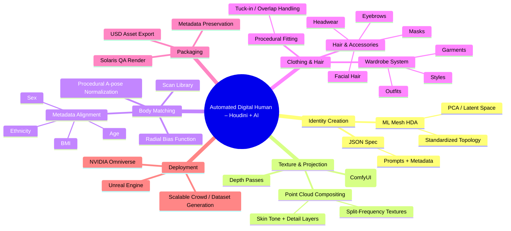

```mermaid
mindmap
  root((Automated Digital Human – Houdini + AI))

    Identity Creation
      JSON Spec
        Prompts + Metadata
      ML Mesh HDA
        PCA / Latent Space
        Standardized Topology

    Texture & Projection
      Diffusion (ComfyUI)
      Depth Passes
      Point Cloud Compositing
        Split-Frequency Textures
        Skin Tone + Detail Layers

    Body Matching
      Scan Library
      Radial Bias Function
      Procedural A-pose Normalization
      Metadata Alignment
        Age
        Sex
        BMI
        Ethnicity

    Clothing & Hair
      Wardrobe System
        Garments
        Outfits
        Styles
      Procedural Fitting
        Tuck-in / Overlap Handling
      Hair & Accessories
        Eyebrows
        Facial Hair
        Masks
        Headwear

    Packaging
      Solaris QA Render
      USD Asset Export
      Metadata Preservation

    Deployment
      Unreal Engine
      NVIDIA Omniverse
      Scalable Crowd / Dataset Generation


```